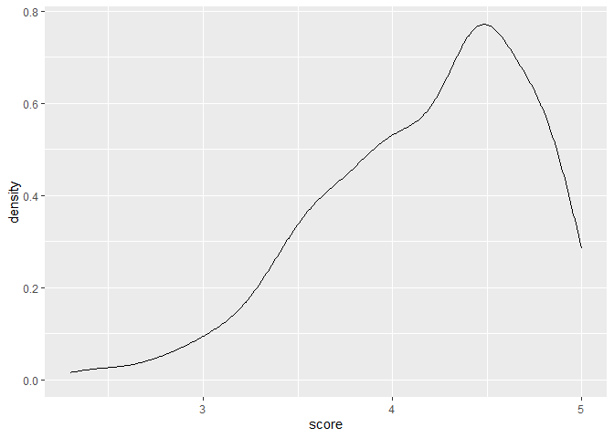
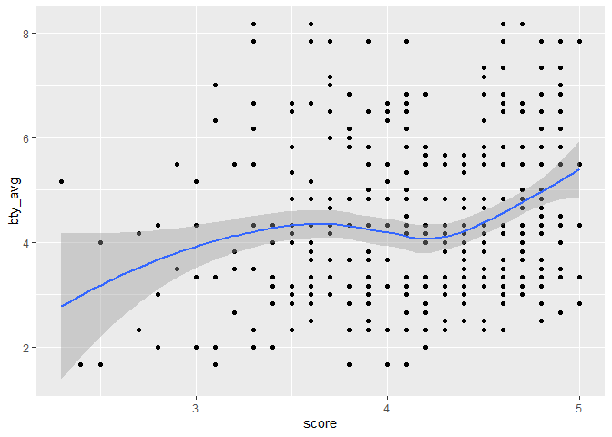
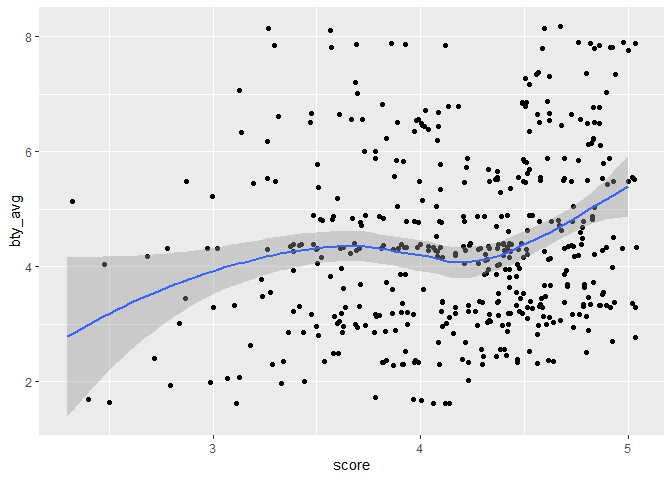
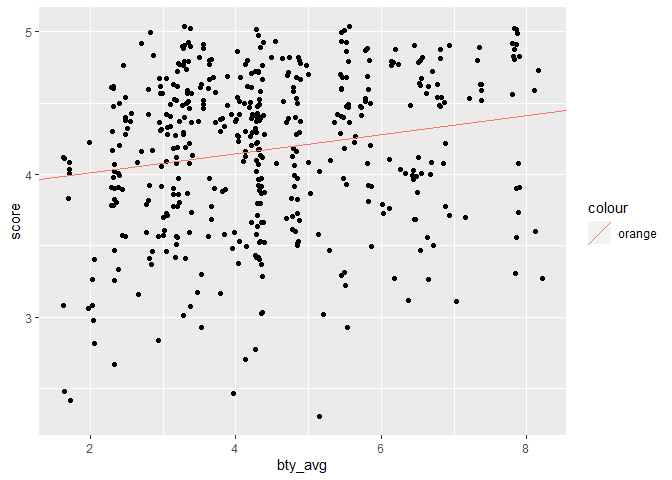

Lab 09 - Grading the professor, Pt. 1
================
Qilin Zhang
3/23/2023

### Load packages and data

### Exercise 1

It seems like people tend to rate professor relatively high. The
distribution appears to be slight skewed to the left.

``` r
evals <- evals

#descriptive analysis
temp <- evals %>%
  select(score) 
descr_score <- apply(temp, 2, as.numeric)
describe(descr_score)
```

    ##    vars   n mean   sd median trimmed  mad min max range skew kurtosis   se
    ## X1    1 463 4.17 0.54    4.3    4.22 0.59 2.3   5   2.7 -0.7     0.04 0.03

``` r
#visualization
evals %>%
  ggplot(aes(score))+
  geom_density()
```

<!-- -->

### Exercise 2

It seems like beauty rating is positively correlated with scores.

``` r
evals %>%
  ggplot(aes(x=score, y=bty_avg))+
  geom_point()+
  geom_smooth()
```

    ## `geom_smooth()` using method = 'loess' and formula = 'y ~ x'

<!-- -->

### Exercise 3

it adds random error into the original data to make dots in the same
position more distinctive with each other. Therefore, we will be able to
see the density of the scores better with jitter plot.

``` r
evals %>%
  ggplot(aes(x=score, y=bty_avg))+
  geom_jitter()+
  geom_smooth()
```

    ## `geom_smooth()` using method = 'loess' and formula = 'y ~ x'

<!-- --> \###exercise 4

``` r
m_bty <-
  lm(score~bty_avg,data = evals)
summary(m_bty)
```

    ## 
    ## Call:
    ## lm(formula = score ~ bty_avg, data = evals)
    ## 
    ## Residuals:
    ##     Min      1Q  Median      3Q     Max 
    ## -1.9246 -0.3690  0.1420  0.3977  0.9309 
    ## 
    ## Coefficients:
    ##             Estimate Std. Error t value Pr(>|t|)    
    ## (Intercept)  3.88034    0.07614   50.96  < 2e-16 ***
    ## bty_avg      0.06664    0.01629    4.09 5.08e-05 ***
    ## ---
    ## Signif. codes:  0 '***' 0.001 '**' 0.01 '*' 0.05 '.' 0.1 ' ' 1
    ## 
    ## Residual standard error: 0.5348 on 461 degrees of freedom
    ## Multiple R-squared:  0.03502,    Adjusted R-squared:  0.03293 
    ## F-statistic: 16.73 on 1 and 461 DF,  p-value: 5.083e-05

``` r
#y=3.88034+0.06664x
```

\###exercise 5

``` r
evals %>%
  ggplot(aes(y=score, x=bty_avg))+
  geom_jitter()+
  geom_abline(aes(intercept = 3.88034, slope = 0.06664, color = "orange"))
```

<!-- -->

\###exercise 6 The slope indicate that every 1 point increase in bty_avg
associate with 0.06664 increase in score.

\###exercise 7 The intercept does not make sense in this context. It
indicate the score when the bty_avg is 0, the score will be 3.8804.
There is no one who score 0 in bty_avg (and likely not possible), so it
does not make a lot of sense to follow it.

\###exercise 8 It seems like bty_avg explain about 3.5% of the variance
in score. It seems like it only have weak predictability to score.

\###exercise 9 + 10 It seems like scores are significantly difference
based on gender. In particular, male tends to have higher score over
female.

``` r
m_gen <-
  lm(score~gender, data = evals)
summary(m_gen)
```

    ## 
    ## Call:
    ## lm(formula = score ~ gender, data = evals)
    ## 
    ## Residuals:
    ##      Min       1Q   Median       3Q      Max 
    ## -1.83433 -0.36357  0.06567  0.40718  0.90718 
    ## 
    ## Coefficients:
    ##             Estimate Std. Error t value Pr(>|t|)    
    ## (Intercept)  4.09282    0.03867 105.852  < 2e-16 ***
    ## gendermale   0.14151    0.05082   2.784  0.00558 ** 
    ## ---
    ## Signif. codes:  0 '***' 0.001 '**' 0.01 '*' 0.05 '.' 0.1 ' ' 1
    ## 
    ## Residual standard error: 0.5399 on 461 degrees of freedom
    ## Multiple R-squared:  0.01654,    Adjusted R-squared:  0.01441 
    ## F-statistic: 7.753 on 1 and 461 DF,  p-value: 0.005583

``` r
#Ymale = 4.09282 + 0.14151
#Yfemale = 4.09282
```

\###exercise 11 + 12 + 13 It seems like there are significant difference
based on rank. In particular, scores tends to be lower among tenure and
tenure track professors.

``` r
m_rank <-
  lm(score~rank, data = evals)
summary(m_rank)
```

    ## 
    ## Call:
    ## lm(formula = score ~ rank, data = evals)
    ## 
    ## Residuals:
    ##     Min      1Q  Median      3Q     Max 
    ## -1.8546 -0.3391  0.1157  0.4305  0.8609 
    ## 
    ## Coefficients:
    ##                  Estimate Std. Error t value Pr(>|t|)    
    ## (Intercept)       4.28431    0.05365  79.853   <2e-16 ***
    ## ranktenure track -0.12968    0.07482  -1.733   0.0837 .  
    ## ranktenured      -0.14518    0.06355  -2.284   0.0228 *  
    ## ---
    ## Signif. codes:  0 '***' 0.001 '**' 0.01 '*' 0.05 '.' 0.1 ' ' 1
    ## 
    ## Residual standard error: 0.5419 on 460 degrees of freedom
    ## Multiple R-squared:  0.01163,    Adjusted R-squared:  0.007332 
    ## F-statistic: 2.706 on 2 and 460 DF,  p-value: 0.06786

``` r
evals$rank_relevel <- relevel(evals$rank, ref = "tenure track")
m_rank_relevel <- 
  lm(score ~ rank_relevel, data = evals)
summary(m_rank_relevel)
```

    ## 
    ## Call:
    ## lm(formula = score ~ rank_relevel, data = evals)
    ## 
    ## Residuals:
    ##     Min      1Q  Median      3Q     Max 
    ## -1.8546 -0.3391  0.1157  0.4305  0.8609 
    ## 
    ## Coefficients:
    ##                      Estimate Std. Error t value Pr(>|t|)    
    ## (Intercept)           4.15463    0.05214  79.680   <2e-16 ***
    ## rank_relevelteaching  0.12968    0.07482   1.733   0.0837 .  
    ## rank_releveltenured  -0.01550    0.06228  -0.249   0.8036    
    ## ---
    ## Signif. codes:  0 '***' 0.001 '**' 0.01 '*' 0.05 '.' 0.1 ' ' 1
    ## 
    ## Residual standard error: 0.5419 on 460 degrees of freedom
    ## Multiple R-squared:  0.01163,    Adjusted R-squared:  0.007332 
    ## F-statistic: 2.706 on 2 and 460 DF,  p-value: 0.06786

``` r
#Ytenured = 4.15463 -0.01550
#Ytenure track = 4.15463
#Ytenured = 4.15463 + 0.12968
#R2 seems to show only weak to no impact from rank. 
```

\###exercise 14 + 15

``` r
evals <- evals %>%
  mutate(tenure_eligible = ifelse(rank == "teaching", "no", "yes"))

m_tenure_eligible <- lm(
  score ~ tenure_eligible,
  data=evals
)
summary(m_tenure_eligible)
```

    ## 
    ## Call:
    ## lm(formula = score ~ tenure_eligible, data = evals)
    ## 
    ## Residuals:
    ##     Min      1Q  Median      3Q     Max 
    ## -1.8438 -0.3438  0.1157  0.4360  0.8562 
    ## 
    ## Coefficients:
    ##                    Estimate Std. Error t value Pr(>|t|)    
    ## (Intercept)          4.2843     0.0536  79.934   <2e-16 ***
    ## tenure_eligibleyes  -0.1406     0.0607  -2.315    0.021 *  
    ## ---
    ## Signif. codes:  0 '***' 0.001 '**' 0.01 '*' 0.05 '.' 0.1 ' ' 1
    ## 
    ## Residual standard error: 0.5413 on 461 degrees of freedom
    ## Multiple R-squared:  0.0115, Adjusted R-squared:  0.009352 
    ## F-statistic: 5.361 on 1 and 461 DF,  p-value: 0.02103

``` r
#Yyes = 4.2843-0.1406
#Yno = 4.2843
#The R2 show overall a very weak impact of tenure eligibility on course eval scores. 
```
